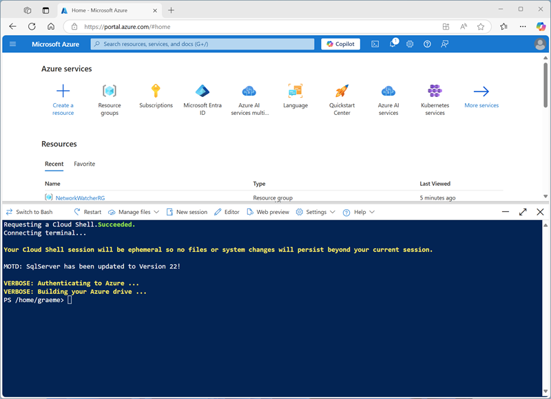

---
lab:
  title: Verwenden von Apache Spark in Azure Databricks
---

# Verwenden von Apache Spark in Azure Databricks

Azure Databricks ist eine Microsoft Azure-basierte Version der beliebten Open-Source-Databricks-Plattform. Azure Databricks basiert auf Apache Spark und bietet eine hoch skalierbare Lösung für Datentechnik- und Analyseaufgaben, die das Arbeiten mit Daten in Dateien beinhalten. Einer der Vorteile von Spark ist die Unterstützung für eine Vielzahl von Programmiersprachen (einschließlich Java, Scala, Python und SQL). Dies macht Spark zu einer sehr flexiblen Lösung für Datenverarbeitungsworkloads (einschließlich Datenbereinigung und -manipulation, statistischer Analysen, maschinellem Lernen, Datenanalysen und Visualisierungen).

Diese Übung dauert ca. **45** Minuten.

## Bereitstellen eines Azure Databricks-Arbeitsbereichs

> **Tipp**: Wenn Sie bereits über einen Azure Databricks-Arbeitsbereich verfügen, können Sie dieses Verfahren überspringen und Ihren vorhandenen Arbeitsbereich verwenden.

Diese Übung enthält ein Skript zum Bereitstellen eines neuen Azure Databricks-Arbeitsbereichs. Das Skript versucht, eine Azure Databricks-Arbeitsbereichsressource im *Premium*-Tarif in einer Region zu erstellen, in der Ihr Azure-Abonnement über ein ausreichendes Kontingent für die in dieser Übung erforderlichen Computekerne verfügt. Es wird davon ausgegangen, dass Ihr Benutzerkonto über ausreichende Berechtigungen im Abonnement verfügt, um eine Azure Databricks-Arbeitsbereichsressource zu erstellen. Wenn das Skript aufgrund unzureichender Kontingente oder Berechtigungen fehlschlägt, können Sie versuchen, einen Azure Databricks-Arbeitsbereich interaktiv im Azure-Portal zu erstellen.

1. Melden Sie sich in einem Webbrowser beim [Azure-Portal](https://portal.azure.com) unter `https://portal.azure.com` an.
2. Verwenden Sie rechts neben der Suchleiste oben auf der Seite die Schaltfläche **[\>_]**, um eine neue Cloud Shell-Instanz im Azure-Portal zu erstellen. Wählen Sie eine ***PowerShell***-Umgebung aus, und erstellen Sie Speicher, falls Sie dazu aufgefordert werden. Die Cloud Shell bietet eine Befehlszeilenschnittstelle in einem Bereich am unteren Rand des Azure-Portals, wie hier gezeigt:

    

    > **Hinweis**: Wenn Sie zuvor eine Cloud Shell erstellt haben, die eine *Bash*-Umgebung verwendet, ändern Sie diese mithilfe des Dropdownmenüs oben links im Cloud Shell-Bereich zu ***PowerShell***.

3. Beachten Sie, dass Sie die Größe der Cloud Shell durch Ziehen der Trennzeichenleiste oben im Bereich ändern können oder den Bereich mithilfe der Symbole **&#8212;**, **&#9723;** und **X** oben rechts minimieren, maximieren und schließen können. Weitere Informationen zur Verwendung von Azure Cloud Shell finden Sie in der [Azure Cloud Shell-Dokumentation](https://docs.microsoft.com/azure/cloud-shell/overview).

4. Geben Sie im PowerShell-Bereich die folgenden Befehle ein, um dieses Repository zu klonen:

    ```
    rm -r mslearn-databricks -f
    git clone https://github.com/MicrosoftLearning/mslearn-databricks
    ```

5. Nachdem das Repository geklont wurde, geben Sie den folgenden Befehl ein, um das Skript **setup.ps1** auszuführen, das einen Azure Databricks-Arbeitsbereich in einer verfügbaren Region bereitstellt:

    ```
    ./mslearn-databricks/setup.ps1
    ```

6. Wenn Sie dazu aufgefordert werden, wählen Sie aus, welches Abonnement Sie verwenden möchten (dies geschieht nur, wenn Sie Zugriff auf mehrere Azure-Abonnements haben).
7. Warten Sie, bis das Skript abgeschlossen ist. Dies dauert in der Regel etwa 5 Minuten, in einigen Fällen kann es jedoch länger dauern. Während Sie warten, lesen Sie den Artikel [Explorative Datenanalyse in Azure Databricks](https://learn.microsoft.com/azure/databricks/exploratory-data-analysis/) in der Dokumentation zu Azure Databricks.

## Erstellen eines Clusters

Azure Databricks ist eine verteilte Verarbeitungsplattform, die Apache Spark-*Cluster* verwendet, um Daten parallel auf mehreren Knoten zu verarbeiten. Jeder Cluster besteht aus einem Treiberknoten, um die Arbeit zu koordinieren, und Arbeitsknoten zum Ausführen von Verarbeitungsaufgaben. In dieser Übung erstellen Sie einen *Einzelknotencluster* , um die in der Lab-Umgebung verwendeten Computeressourcen zu minimieren (in denen Ressourcen möglicherweise eingeschränkt werden). In einer Produktionsumgebung erstellen Sie in der Regel einen Cluster mit mehreren Workerknoten.

> **Tipp**: Wenn Sie bereits über einen Cluster mit einer Runtime 13.3 LTS oder einer höheren Runtimeversion in Ihrem Azure Databricks-Arbeitsbereich verfügen, können Sie ihn verwenden, um diese Übung abzuschließen und dieses Verfahren zu überspringen.

1. Navigieren Sie im Azure-Portal zur Ressourcengruppe **msl-*xxxxxxx***, die vom Skript erstellt wurde (oder zur Ressourcengruppe, die Ihren vorhandenen Azure Databricks-Arbeitsbereich enthält).
1. Wählen Sie die Ressource Ihres Azure Databricks-Diensts aus (sie trägt den Namen **databricks-*xxxxxxx***, wenn Sie das Setupskript zum Erstellen verwendet haben).
1. Verwenden Sie auf der Seite **Übersicht** für Ihren Arbeitsbereich die Schaltfläche **Arbeitsbereich starten**, um Ihren Azure Databricks-Arbeitsbereich auf einer neuen Browserregisterkarte zu öffnen. Melden Sie sich an, wenn Sie dazu aufgefordert werden.

    > **Tipp**: Während Sie das Databricks-Arbeitsbereichsportal verwenden, werden möglicherweise verschiedene Tipps und Benachrichtigungen angezeigt. Schließen Sie diese, und folgen Sie den Anweisungen, um die Aufgaben in dieser Übung auszuführen.

1. Wählen Sie zunächst in der Randleiste auf der linken Seite die Aufgabe **(+) Neu** und dann **Cluster** aus.
1. Erstellen Sie auf der Seite **Neuer Cluster** einen neuen Cluster mit den folgenden Einstellungen:
    - **Clustername**: Cluster des *Benutzernamens* (der Standardclustername)
    - **Richtlinie:** Unrestricted
    - **Clustermodus**: Einzelknoten
    - **Zugriffsmodus**: Einzelner Benutzer (*Ihr Benutzerkonto ist ausgewählt*)
    - **Databricks-Runtimeversion**: 13.3 LTS (Spark 3.4.1, Scala 2.12) oder höher
    - **Photonbeschleunigung verwenden**: Ausgewählt
    - **Knotentyp**: Standard_DS3_v2
    - **Beenden nach** *20* **Minuten Inaktivität**

1. Warten Sie, bis der Cluster erstellt wurde. Es kann ein oder zwei Minuten dauern.

> **Hinweis**: Wenn Ihr Cluster nicht gestartet werden kann, verfügt Ihr Abonnement möglicherweise über ein unzureichendes Kontingent in der Region, in der Ihr Azure Databricks-Arbeitsbereich bereitgestellt wird. Details finden Sie unter [Der Grenzwert für CPU-Kerne verhindert die Clustererstellung](https://docs.microsoft.com/azure/databricks/kb/clusters/azure-core-limit). In diesem Fall können Sie versuchen, Ihren Arbeitsbereich zu löschen und in einer anderen Region einen neuen zu erstellen. Sie können einen Bereich als Parameter für das Setupskript wie folgt angeben: `./mslearn-databricks/setup.ps1 eastus`

## Durchsuchen von Daten mithilfe von Spark

Wie in vielen Spark-Umgebungen unterstützt Databricks die Verwendung von Notebooks zum Kombinieren von Notizen und interaktiven Codezellen, mit denen Sie Daten untersuchen können.

### Erstellen eines Notebooks

1. Verwenden Sie in der Randleiste den Link ** (+) Neu**, um ein **Notebook** zu erstellen.
1. Ändern Sie den Standardnamen des Notebooks (**Unbenanntes Notebook *[Datum]***) in **Explore data with Spark**, und wählen Sie in der Dropdownliste **Verbinden** Ihren Cluster aus, sofern er noch nicht ausgewählt ist. Wenn der Cluster nicht ausgeführt wird, kann es eine Minute dauern, bis er gestartet wird.

### Einlesen von Daten

1. Geben Sie in der ersten Zelle des Notebooks den folgenden Code ein, der mit *Shell*-Befehlen die Datendateien von GitHub in das von Ihrem Cluster verwendete Dateisystem herunterlädt.

    ```python
    %sh
    rm -r /dbfs/spark_lab
    mkdir /dbfs/spark_lab
    wget -O /dbfs/spark_lab/2019.csv https://raw.githubusercontent.com/MicrosoftLearning/mslearn-databricks/main/data/2019.csv
    wget -O /dbfs/spark_lab/2020.csv https://raw.githubusercontent.com/MicrosoftLearning/mslearn-databricks/main/data/2020.csv
    wget -O /dbfs/spark_lab/2021.csv https://raw.githubusercontent.com/MicrosoftLearning/mslearn-databricks/main/data/2021.csv
    ```

1. Verwenden Sie Menüoption **&#9656; Zelle Ausführen** links neben der Zelle, um sie auszuführen. Warten Sie dann, bis der vom Code ausgeführte Spark-Auftrag, abgeschlossen ist.

### Abfragen von Daten in Dateien

1. Verwenden Sie unter der vorhandenen Codezelle das Symbol **+**, um eine neue Codezelle hinzuzufügen. Geben Sie dann in die neue Zelle den folgenden Code ein, und führen Sie ihn aus, um die Daten aus den Dateien zu laden und die ersten 100 Zeilen anzuzeigen.

    ```python
   df = spark.read.load('spark_lab/*.csv', format='csv')
   display(df.limit(100))
    ```

1. Zeigen Sie die Ausgabe an, und beachten Sie, dass sich die Daten in der Datei auf Verkaufsaufträge beziehen, aber keine Spaltenüberschriften oder Informationen über die Datentypen enthalten. Um die Daten übersichtlicher zu gestalten, können Sie ein *Schema* für den DataFrame definieren.

1. Fügen Sie eine neue Codezelle hinzu, und verwenden Sie diese, um den folgenden Code auszuführen, der ein Schema für die Daten definiert:

    ```python
   from pyspark.sql.types import *
   from pyspark.sql.functions import *
   orderSchema = StructType([
        StructField("SalesOrderNumber", StringType()),
        StructField("SalesOrderLineNumber", IntegerType()),
        StructField("OrderDate", DateType()),
        StructField("CustomerName", StringType()),
        StructField("Email", StringType()),
        StructField("Item", StringType()),
        StructField("Quantity", IntegerType()),
        StructField("UnitPrice", FloatType()),
        StructField("Tax", FloatType())
   ])
   df = spark.read.load('/spark_lab/*.csv', format='csv', schema=orderSchema)
   display(df.limit(100))
    ```

1. Beachten Sie, dass der DataFrame dieses Mal Spaltenüberschriften enthält. Fügen Sie dann eine neue Codezelle hinzu und verwenden Sie diese, um den folgenden Code auszuführen, um Details des DataFrame-Schemas anzuzeigen und zu überprüfen, ob die richtigen Datentypen angewendet wurden:

    ```python
   df.printSchema()
    ```

### Filtern eines Dataframes

1. Fügen Sie eine neue Codezelle hinzu, und verwenden Sie diese, um den folgenden Code auszuführen, der Folgendes ausführt:
    - Filtern der Spalten des DataFrame für Verkaufsaufträge, um nur den Kundennamen und die E-Mail-Adresse einzuschließen.
    - Zählen der Gesamtzahl der Bestelldatensätze
    - Zählen der Anzahl unterschiedlicher Kunden
    - Anzeigen der unterschiedlichen Kunden

    ```python
   customers = df['CustomerName', 'Email']
   print(customers.count())
   print(customers.distinct().count())
   display(customers.distinct())
    ```

    Beachten Sie die folgenden Details:

    - Wenn Sie einen Vorgang für einen Dataframe ausführen, ist das Ergebnis ein neuer Dataframe (in diesem Fall wird ein neuer customers-Dataframe erstellt, indem eine bestimmte Teilmenge von Spalten aus dem df-Dataframe ausgewählt wird).
    - Dataframes bieten Funktionen wie count und distinct, die zum Zusammenfassen und Filtern der darin enthaltenen Daten verwendet werden können.
    - Die Syntax `dataframe['Field1', 'Field2', ...]` ist eine Kurzform für die Definition einer Teilmenge von Spalten. Sie können auch die **select**-Methode verwenden, sodass die erste Zeile des obigen Codes wie folgt geschrieben werden kann: `customers = df.select("CustomerName", "Email")`.

1. Jetzt wenden wir einen Filter an, um nur die Kunden einzuschließen, die eine Bestellung für ein bestimmtes Produkt aufgegeben haben, indem wir den folgenden Code in einer neuen Codezelle ausführen:

    ```python
   customers = df.select("CustomerName", "Email").where(df['Item']=='Road-250 Red, 52')
   print(customers.count())
   print(customers.distinct().count())
   display(customers.distinct())
    ```

    Beachten Sie, dass Sie mehrere Funktionen miteinander „verketten“ können, sodass die Ausgabe der einen Funktion zur Eingabe für die nächste wird. In diesem Fall ist der von der select-Methode erstellte DataFrame der Quell-DataFrame für die where-Methode, die zum Anwenden von Filterkriterien verwendet wird.

### Aggregieren und Gruppieren von Daten in einem Dataframe

1. Führen Sie den folgenden Code in einer neuen Codezelle aus, um die Bestelldaten zu aggregieren und zu gruppieren:

    ```python
   productSales = df.select("Item", "Quantity").groupBy("Item").sum()
   display(productSales)
    ```

    Beachten Sie, dass in den Ergebnissen die Summe der Bestellmengen nach Produkt gruppiert angezeigt wird. Die **groupBy**-Methode gruppiert die Zeilen nach *Item*, und die nachfolgende **sum**-Aggregatfunktion wird auf alle verbleibenden numerischen Spalten angewendet (in diesem Fall *Quantity*).

1. Probieren wir in einer neuen Codezelle eine weitere Aggregation aus:

    ```python
   yearlySales = df.select(year("OrderDate").alias("Year")).groupBy("Year").count().orderBy("Year")
   display(yearlySales)
    ```

    Dieses Mal zeigen die Ergebnisse die Anzahl der Verkaufsaufträge pro Jahr. Beachten Sie, dass die select-Methode eine SQL-Funktion **year** enthält, um die Jahreskomponente des Felds *OrderDate* zu extrahieren, und anschließend wird eine **alias**-Methode verwendet, um dem extrahierten Jahreswert einen Spaltennamen zuzuweisen. Die Daten werden dann nach der abgeleiteten *Year*-Spalte gruppiert. Anschließend wird mit **count** die Anzahl der Zeilen in jeder Gruppe berechnet, bevor schließlich die **orderBy**-Methode verwendet wird, um den resultierenden DataFrame zu sortieren.

> **Hinweis:** Weitere Informationen zum Arbeiten mit DataFrames in Azure Databricks finden Sie in der Azure Databricks-Dokumentation unter [Einführung in DataFrames – Python](https://docs.microsoft.com/azure/databricks/spark/latest/dataframes-datasets/introduction-to-dataframes-python).

### Abfragen von Daten mithilfe von Spark SQL

1. Fügen Sie eine neue Codezelle hinzu, und verwenden Sie diese, um den folgenden Code auszuführen:

    ```python
   df.createOrReplaceTempView("salesorders")
   spark_df = spark.sql("SELECT * FROM salesorders")
   display(spark_df)
    ```

    Mit den nativen Methoden des Dataframe-Objekts, das Sie zuvor verwendet haben, können Sie Daten sehr effektiv abfragen und analysieren. Viele Datenanalysten arbeiten jedoch lieber mit SQL-Syntax. Spark SQL ist eine SQL-Sprach-API in Spark, die Sie verwenden können, um SQL-Anweisungen auszuführen oder sogar um Daten in relationalen Tabellen zu speichern. Der soeben ausgeführte Code erstellt eine relationale *Ansicht* der Daten in einem DataFrame und verwendet dann die Bibliothek **spark.sql**, um Spark SQL-Syntax in Ihren Python-Code einzubetten, die Ansicht abzufragen und die Ergebnisse als Datenframe zurückzugeben.

### Ausführen von SQL-Code in einer Zelle

1. Obwohl es nützlich ist, SQL-Anweisungen in eine Zelle einzubetten, die PySpark-Code enthält, arbeiten Datenanalysten oft lieber direkt mit SQL. Fügen Sie eine neue Codezelle hinzu, und verwenden Sie diese, um den folgenden Code auszuführen.

    ```sql
   %sql
    
   SELECT YEAR(OrderDate) AS OrderYear,
          SUM((UnitPrice * Quantity) + Tax) AS GrossRevenue
   FROM salesorders
   GROUP BY YEAR(OrderDate)
   ORDER BY OrderYear;
    ```

    Beachten Sie, Folgendes:
    
    - Die Zeile ``%sql` am Anfang der Zelle („Magic-Befehl“ genannt) gibt an, dass anstelle von PySpark die Spark SQL-Runtime verwendet werden soll, um den Code in dieser Zelle auszuführen.
    - Der SQL-Code verweist auf die Ansicht **salesorders**, die Sie zuvor erstellt haben.
    - Die Ausgabe der SQL-Abfrage wird automatisch als Ergebnis unter der Zelle angezeigt.
    
> **Hinweis:** Weitere Informationen zu Spark SQL und Dataframes finden Sie in der [Spark SQL-Dokumentation](https://spark.apache.org/docs/2.2.0/sql-programming-guide.html).

## Visualisieren von Daten mit Spark

Ein Bild sagt sprichwörtlich mehr als tausend Worte, und ein Diagramm ist oft besser als tausend Datenzeilen. Zwar enthalten Notebooks in Azure Databricks Unterstützung für die Visualisierung von Daten aus einem DataFrame oder einer Spark SQL-Abfrage, doch ist die Ansicht nicht für die umfassende Diagrammdarstellung konzipiert. Sie können jedoch Python-Grafikbibliotheken wie matplotlib und seaborn verwenden, um Diagramme aus Daten in Dataframes zu erstellen.

### Anzeigen von Ergebnissen als Visualisierung

1. Führen Sie in einer neuen Codezelle den folgenden Code aus, um die Tabelle **salesorders** abzufragen:

    ```sql
   %sql
    
   SELECT * FROM salesorders
    ```

1. Wählen Sie oberhalb der Ergebnistabelle **+** und dann **Visualisierung** aus, um den Visualisierungs-Editor anzuzeigen, und wenden Sie dann die folgenden Optionen an:
    - **Visualisierungstyp**: Balken
    - **X-Spalte**: Element
    - **Y-Spalte**: *Fügen Sie eine neue Spalte hinzu, und wählen Sie ***Menge** aus. *Wenden Sie die Aggregation* **Summe** *aus*.
    
1. Speichern Sie die Visualisierung, und führen Sie dann die Codezelle erneut aus, um das resultierende Diagramm im Notebook anzuzeigen.

### Erste Schritte mit matplotlib

1. Führen Sie in einer neuen Codezelle den folgenden Code aus, um einige Verkaufsauftragsdaten in einen DataFrame abzurufen:

    ```python
   sqlQuery = "SELECT CAST(YEAR(OrderDate) AS CHAR(4)) AS OrderYear, \
                   SUM((UnitPrice * Quantity) + Tax) AS GrossRevenue \
            FROM salesorders \
            GROUP BY CAST(YEAR(OrderDate) AS CHAR(4)) \
            ORDER BY OrderYear"
   df_spark = spark.sql(sqlQuery)
   df_spark.show()
    ```

1. Fügen Sie eine neue Codezelle hinzu, und verwenden Sie diese, um den folgenden Code auszuführen, der die Bibliothek **matplotlib** importiert und zum Erstellen eines Diagramms verwendet:

    ```python
   from matplotlib import pyplot as plt
    
   # matplotlib requires a Pandas dataframe, not a Spark one
   df_sales = df_spark.toPandas()
   # Create a bar plot of revenue by year
   plt.bar(x=df_sales['OrderYear'], height=df_sales['GrossRevenue'])
   # Display the plot
   plt.show()
    ```

1. Überprüfen Sie die Ergebnisse, die aus einem Säulendiagramm mit dem Gesamtbruttoumsatz für jedes Jahr bestehen. Beachten Sie die folgenden Features des Codes, der zum Erstellen dieses Diagramms verwendet wird:
    - Die Bibliothek **matplotlib** erfordert einen Pandas-DataFrame. Deshalb müssen Sie den Spark-DataFrame, der von der Spark SQL-Abfrage zurückgegeben wird, in dieses Format konvertieren.
    - Der Kern der **matplotlib**-Bibliothek ist das **pyplot**-Objekt. Dies ist die Grundlage für die meisten Darstellungsfunktionen.

1. Die Standardeinstellungen ergeben ein brauchbares Diagramm, aber es gibt beträchtliche Möglichkeiten, es anzupassen. Fügen Sie eine neue Codezelle mit dem folgenden Code hinzu, und führen Sie ihn aus:

    ```python
   # Clear the plot area
   plt.clf()
   # Create a bar plot of revenue by year
   plt.bar(x=df_sales['OrderYear'], height=df_sales['GrossRevenue'], color='orange')
   # Customize the chart
   plt.title('Revenue by Year')
   plt.xlabel('Year')
   plt.ylabel('Revenue')
   plt.grid(color='#95a5a6', linestyle='--', linewidth=2, axis='y', alpha=0.7)
   plt.xticks(rotation=45)
   # Show the figure
   plt.show()
    ```

1. Plots sind technisch gesehen in **Abbildungen** enthalten. In den vorherigen Beispielen wurde die Abbildung implizit für Sie erstellt, aber Sie können sie auch explizit erstellen. Versuchen Sie, Folgendes in einer neuen Zelle auszuführen:

    ```python
   # Clear the plot area
   plt.clf()
   # Create a Figure
   fig = plt.figure(figsize=(8,3))
   # Create a bar plot of revenue by year
   plt.bar(x=df_sales['OrderYear'], height=df_sales['GrossRevenue'], color='orange')
   # Customize the chart
   plt.title('Revenue by Year')
   plt.xlabel('Year')
   plt.ylabel('Revenue')
   plt.grid(color='#95a5a6', linestyle='--', linewidth=2, axis='y', alpha=0.7)
   plt.xticks(rotation=45)
   # Show the figure
   plt.show()
    ```

1. Eine Abbildung kann mehrere Teilplots enthalten (jeweils auf einer eigenen Achse). Verwenden Sie diesen Code zum Erstellen mehrerer Diagramme:

    ```python
   # Clear the plot area
   plt.clf()
   # Create a figure for 2 subplots (1 row, 2 columns)
   fig, ax = plt.subplots(1, 2, figsize = (10,4))
   # Create a bar plot of revenue by year on the first axis
   ax[0].bar(x=df_sales['OrderYear'], height=df_sales['GrossRevenue'], color='orange')
   ax[0].set_title('Revenue by Year')
   # Create a pie chart of yearly order counts on the second axis
   yearly_counts = df_sales['OrderYear'].value_counts()
   ax[1].pie(yearly_counts)
   ax[1].set_title('Orders per Year')
   ax[1].legend(yearly_counts.keys().tolist())
   # Add a title to the Figure
   fig.suptitle('Sales Data')
   # Show the figure
   plt.show()
    ```

> **Hinweis:** Weitere Informationen zur Darstellung mit „matplotlib“ finden Sie in der [matplotlib-Dokumentation](https://matplotlib.org/).

### Verwenden der seaborn-Bibliothek

1. Fügen Sie eine neue Codezelle hinzu, und verwenden Sie sie, um den folgenden Code auszuführen, der die Bibliothek **seaborn** (die auf matplotlib basiert und einen Teil ihrer Komplexität abstrahiert) zum Erstellen eines Diagramms verwendet:

    ```python
   import seaborn as sns
   
   # Clear the plot area
   plt.clf()
   # Create a bar chart
   ax = sns.barplot(x="OrderYear", y="GrossRevenue", data=df_sales)
   plt.show()
    ```

1. Die Bibliothek **seaborn** vereinfacht die Erstellung komplexer Diagramme für statistische Daten und ermöglicht es Ihnen, das visuelle Thema für konsistente Datenvisualisierungen zu steuern. Führen Sie den folgenden Code in eine neue Zelle aus:

    ```python
   # Clear the plot area
   plt.clf()
   
   # Set the visual theme for seaborn
   sns.set_theme(style="whitegrid")
   
   # Create a bar chart
   ax = sns.barplot(x="OrderYear", y="GrossRevenue", data=df_sales)
   plt.show()
    ```

1. Wie matplotlib. seaborn unterstützt mehrere Diagrammtypen. Führen Sie den folgenden Code aus, um ein Liniendiagramm zu erstellen:

    ```python
   # Clear the plot area
   plt.clf()
   
   # Create a bar chart
   ax = sns.lineplot(x="OrderYear", y="GrossRevenue", data=df_sales)
   plt.show()
    ```

> **Hinweis:** Weitere Informationen zur Darstellung mithilfe der seaborn-Bibliothek finden Sie in der [seaborn-Dokumentation](https://seaborn.pydata.org/index.html).

## Bereinigung

Wählen Sie zunächst im Azure Databricks-Portal auf der Seite **Compute** Ihren Cluster und dann **&#9632; Beenden** aus, um ihn herunterzufahren.

Wenn Sie die Erkundung von Azure Databricks abgeschlossen haben, löschen Sie die erstellten Ressourcen, um unnötige Azure-Kosten zu vermeiden und Kapazität in Ihrem Abonnement freizugeben.