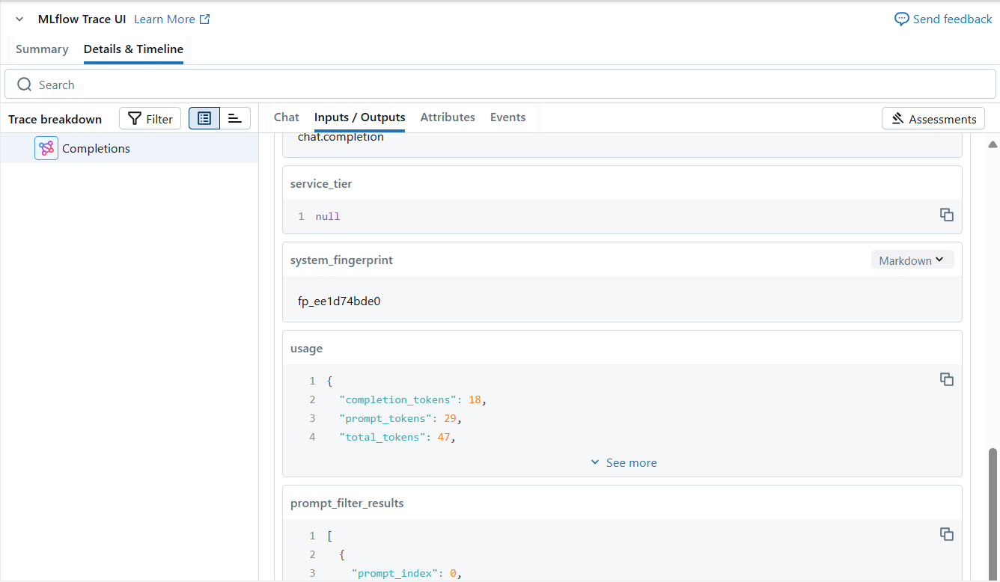

---
lab:
  title: Implementieren von LLMOps mit Azure Databricks
---

# Implementieren von LLMOps mit Azure Databricks

Azure Databricks bietet eine einheitliche Plattform, die den KI-Lebenszyklus von der Datenvorbereitung über die Modellbereitstellung bis hin zur Überwachung optimiert und so die Leistung und Effizienz von Machine Learning-Systemen steigert. Es unterstützt die Entwicklung von generativen KI-Anwendungen und nutzt Features wie Unity Catalog für Datengovernance, MLflow für die Modellverfolgung und Mosaik AI Model Serving für die Bereitstellung von LLMs.

Dieses Lab dauert ungefähr **20** Minuten.

> **Hinweis**: Die Benutzeroberfläche von Azure Databricks wird kontinuierlich verbessert. Die Benutzeroberfläche kann sich seit der Erstellung der Anweisungen in dieser Übung geändert haben.

## Vor der Installation

Sie benötigen ein [Azure-Abonnement](https://azure.microsoft.com/free), in dem Sie Administratorzugriff besitzen.

## Bereitstellen einer Azure OpenAI-Ressource

Wenn Sie noch keine Azure OpenAI-Ressource haben, stellen Sie eine in Ihrem Azure-Abonnement bereit.

1. Melden Sie sich beim **Azure-Portal** unter `https://portal.azure.com` an.
2. Erstellen Sie eine **Azure OpenAI-Ressource** mit den folgenden Einstellungen:
    - **Abonnement:** *Wählen Sie ein Azure-Abonnement aus, das für den Zugriff auf den Azure OpenAI-Dienst freigegeben wurde.*
    - **Ressourcengruppe**: *Wählen Sie eine Ressourcengruppe aus, oder erstellen Sie eine*.
    - **Region:** *Treffen Sie eine **zufällige** Auswahl aus einer der folgenden Regionen*\*
        - USA (Ost) 2
        - USA Nord Mitte
        - Schweden, Mitte
        - Schweiz, Westen
    - **Name:** *Wählen Sie einen Namen Ihrer Wahl aus.*
    - **Tarif**: Standard S0.

> \* Azure OpenAI-Ressourcen werden durch regionale Kontingente eingeschränkt. Die aufgeführten Regionen enthalten das Standardkontingent für die in dieser Übung verwendeten Modelltypen. Durch die zufällige Auswahl einer Region wird das Risiko reduziert, dass eine einzelne Region ihr Kontingentlimit in Szenarien erreicht, in denen Sie ein Abonnement für andere Benutzer freigeben. Wenn später in der Übung ein Kontingentlimit erreicht wird, besteht eventuell die Möglichkeit, eine andere Ressource in einer anderen Region zu erstellen.

3. Warten Sie, bis die Bereitstellung abgeschlossen ist. Wechseln Sie dann zur bereitgestellten Azure OpenAI-Ressource im Azure-Portal.

4. Wählen Sie im linken Fensterbereich unter **Ressourcenverwaltung** die Option **Tasten und Endpunkt**.

5. Kopieren Sie den Endpunkt und einen der verfügbaren Schlüssel, da Sie ihn später in dieser Übung verwenden werden.

## Bereitstellen des erforderlichen Modells

Azure bietet ein webbasiertes Portal namens **Azure AI Studio**, das Sie zur Bereitstellung, Verwaltung und Untersuchung von Modellen verwenden können. Sie beginnen Ihre Erkundung von Azure OpenAI, indem Sie Azure AI Studio verwenden, um ein Modell bereitzustellen.

> **Hinweis**: Während Sie Azure AI Studio verwenden, werden möglicherweise Meldungsfelder mit Vorschlägen für auszuführende Aufgaben angezeigt. Sie können diese schließen und die Schritte in dieser Übung ausführen.

1. Scrollen Sie im Azure-Portal auf der Seite **Übersicht** für Ihre Azure OpenAI-Ressource nach unten zum Abschnitt **Erste Schritte** und klicken Sie auf die Schaltfläche, um zu **Azure AI Studio** zu gelangen.
   
1. Wählen Sie in Azure AI Studio im linken Bereich die Seite "**Deployments**" aus und sehen Sie sich Ihre vorhandenen Modellbereitstellungen an. Falls noch nicht vorhanden, erstellen Sie eine neue Bereitstellung des **gpt-35-turbo**-Modells mit den folgenden Einstellungen:
    - **Bereitstellungsname**: *gpt-35-turbo*
    - **Modell**: gpt-35-turbo
    - **Modellversion**: Standard
    - **Bereitstellungstyp**: Standard
    - **Ratenlimit für Token pro Minute**: 5K\*
    - **Inhaltsfilter**: Standard
    - **Dynamische Quote aktivieren**: Deaktiviert
    
> \* Ein Ratenlimit von 5.000 Token pro Minute ist mehr als ausreichend, um diese Aufgabe zu erfüllen und gleichzeitig Kapazität für andere Personen zu schaffen, die das gleiche Abonnement nutzen.

## Bereitstellen eines Azure Databricks-Arbeitsbereichs

> **Tipp**: Wenn Sie bereits über einen Azure Databricks-Arbeitsbereich verfügen, können Sie dieses Verfahren überspringen und Ihren vorhandenen Arbeitsbereich verwenden.

1. Melden Sie sich beim **Azure-Portal** unter `https://portal.azure.com` an.
2. Erstellen Sie eine **Azure Databricks**-Ressource mit den folgenden Einstellungen:
    - **Abonnement**: *Wählen Sie das gleiche Azure-Abonnement aus, das Sie zum Erstellen Ihrer Azure OpenAI-Ressource verwendet haben*
    - **Ressourcengruppe**: *Die gleiche Ressourcengruppe, in der Sie Ihre Azure OpenAI-Ressource erstellt haben*
    - **Region**: *Die gleiche Region, in der Sie Ihre Azure OpenAI-Ressource erstellt haben*
    - **Name:** *Wählen Sie einen Namen Ihrer Wahl aus.*
    - **Preisstufe**: *Premium* oder *Testversion*

3. Wählen Sie **Überprüfen + Erstellen** und warten Sie, bis die Bereitstellung abgeschlossen ist. Wechseln Sie dann zur Ressource, und starten Sie den Arbeitsbereich.

## Erstellen eines Clusters

Azure Databricks ist eine verteilte Verarbeitungsplattform, die Apache Spark-*Cluster* verwendet, um Daten parallel auf mehreren Knoten zu verarbeiten. Jeder Cluster besteht aus einem Treiberknoten, um die Arbeit zu koordinieren, und Arbeitsknoten zum Ausführen von Verarbeitungsaufgaben. In dieser Übung erstellen Sie einen *Einzelknotencluster* , um die in der Lab-Umgebung verwendeten Computeressourcen zu minimieren (in denen Ressourcen möglicherweise eingeschränkt werden). In einer Produktionsumgebung erstellen Sie in der Regel einen Cluster mit mehreren Workerknoten.

> **Tipp**: Wenn Sie bereits über einen Cluster mit einer Runtime 13.3 LTS **<u>ML</u>** oder einer höheren Runtimeversion in Ihrem Azure Databricks-Arbeitsbereich verfügen, können Sie ihn verwenden, um diese Übung abzuschließen, und dieses Verfahren überspringen.

1. Navigieren Sie im Azure-Portal zu der Ressourcengruppe, in der der Azure Databricks-Arbeitsbereich erstellt wurde.
2. Wählen Sie Ihre Azure Databricks Service-Ressource aus.
3. Verwenden Sie auf der Seite **Übersicht** für Ihren Arbeitsbereich die Schaltfläche **Arbeitsbereich starten**, um Ihren Azure Databricks-Arbeitsbereich auf einer neuen Browserregisterkarte zu öffnen. Melden Sie sich an, wenn Sie dazu aufgefordert werden.

> **Tipp**: Während Sie das Databricks-Arbeitsbereichsportal verwenden, werden möglicherweise verschiedene Tipps und Benachrichtigungen angezeigt. Schließen Sie diese, und folgen Sie den Anweisungen, um die Aufgaben in dieser Übung auszuführen.

4. Wählen Sie zunächst in der Randleiste auf der linken Seite die Aufgabe **(+) Neu** und dann **Cluster** aus.
5. Erstellen Sie auf der Seite **Neuer Cluster** einen neuen Cluster mit den folgenden Einstellungen:
    - **Clustername**: Cluster des *Benutzernamens* (der Standardclustername)
    - **Richtlinie:** Unrestricted
    - **Clustermodus**: Einzelknoten
    - **Zugriffsmodus**: Einzelner Benutzer (*Ihr Benutzerkonto ist ausgewählt*)
    - **Databricks-Runtimeversion**: *Wählen Sie die **<u>ML</u>**-Edition der neuesten Nicht-Betaversion der Runtime aus (**Nicht** eine Standard-Runtimeversion), die folgende Kriterien erfüllt:*
        - *Verwendet **keine** GPU*
        - *Umfasst Scala > **2.11***
        - *Umfasst Spark > **3.4***
    - **Photon-Beschleunigung verwenden**: <u>Nicht</u> ausgewählt
    - **Knotentyp**: Standard_D4ds_v5
    - **Beenden nach** *20* **Minuten Inaktivität**

6. Warten Sie, bis der Cluster erstellt wurde. Es kann ein oder zwei Minuten dauern.

> **Hinweis**: Wenn Ihr Cluster nicht gestartet werden kann, verfügt Ihr Abonnement möglicherweise über ein unzureichendes Kontingent in der Region, in der Ihr Azure Databricks-Arbeitsbereich bereitgestellt wird. Details finden Sie unter [Der Grenzwert für CPU-Kerne verhindert die Clustererstellung](https://docs.microsoft.com/azure/databricks/kb/clusters/azure-core-limit). In diesem Fall können Sie versuchen, Ihren Arbeitsbereich zu löschen und in einer anderen Region einen neuen zu erstellen.

## Installieren der erforderlichen Bibliotheken

1. Gehen Sie im Databricks-Arbeitsbereich zum Abschnitt **Arbeitsbereich**.

2. Wählen Sie „**Erstellen**“ und dann „**Notizbuch**“ aus.

3. Geben Sie Ihrem Notizbuch einen Namen und wählen Sie `Python` als Sprache aus.

4. Geben Sie in der ersten Codezelle den folgenden Code ein und führen Sie ihn aus, um die OpenAI-Bibliothek zu installieren:
   
     ```python
    %pip install openai
     ```

5. Nachdem die Installation abgeschlossen ist, starten Sie den Kernel in einer neuen Zelle neu:

     ```python
    %restart_python
     ```

## Protokollieren des LLM mithilfe von MLflow

Mit den LLM-Tracking-Funktionen von MLflow können Sie Parameter, Metriken, Vorhersagen und Artifacts protokollieren. Zu den Parametern gehören Schlüsselwertpaare, die die Eingabekonfigurationen detailliert beschreiben, während Metriken quantitative Leistungsmessungen liefern. Die Vorhersagen umfassen sowohl die Eingabeaufforderungen als auch die Antworten des Modells, die als Artifacts gespeichert werden, um sie leicht abrufen zu können. Diese strukturierte Protokollierung hilft bei der Aufrechterhaltung eines detaillierten Datensatzes jeder Interaktion, wodurch eine bessere Analyse und Optimierung von LLMs erleichtert wird.

1. Führen Sie in einer neuen Zelle den folgenden Code mit den Zugriffsinformationen aus, die Sie am Anfang dieser Übung kopiert haben, um beständige Umgebungsvariablen für die Authentifizierung bei Verwendung von Azure OpenAI-Ressourcen zuzuweisen:

     ```python
    import os

    os.environ["AZURE_OPENAI_API_KEY"] = "your_openai_api_key"
    os.environ["AZURE_OPENAI_ENDPOINT"] = "your_openai_endpoint"
    os.environ["AZURE_OPENAI_API_VERSION"] = "2023-03-15-preview"
     ```
1. Führen Sie in einer neuen Zelle den folgenden Code aus, um Ihren Azure OpenAI-Client zu initialisieren:

     ```python
    import os
    from openai import AzureOpenAI

    client = AzureOpenAI(
       azure_endpoint = os.getenv("AZURE_OPENAI_ENDPOINT"),
       api_key = os.getenv("AZURE_OPENAI_API_KEY"),
       api_version = os.getenv("AZURE_OPENAI_API_VERSION")
    )
     ```

1. Führen Sie in einer neuen Zelle den folgenden Code aus, um MLflow-Tracking zu initialisieren und das Modell zu protokollieren:     

     ```python
    import mlflow
    from openai import AzureOpenAI

    system_prompt = "Assistant is a large language model trained by OpenAI."

    mlflow.openai.autolog()

    with mlflow.start_run():

        response = client.chat.completions.create(
            model="gpt-35-turbo",
            messages=[
                {"role": "system", "content": system_prompt},
                {"role": "user", "content": "Tell me a joke about animals."},
            ],
        )

        print(response.choices[0].message.content)
        mlflow.log_param("completion_tokens", response.usage.completion_tokens)
    mlflow.end_run()
     ```

In der obigen Zelle wird ein Experiment in Ihrem Arbeitsbereich gestartet und die Ablaufverfolgungen jeder Iteration des Chatabschlusses registriert, wobei die Eingaben, Ausgaben und Metadaten jeder Ausführung nachverfolgt werden.

## Überwachen des Modells

1. Wählen Sie in der linken Seitenleiste **Experimente** und dann das Experiment aus, das mit dem Notizbuch verknüpft ist, das Sie für diese Übung verwendet haben. Wählen Sie die letzte Ausführung aus und überprüfen Sie auf der Seite „Übersicht“, ob ein Parameter protokolliert wurde: `completion_tokens`. Der Befehl `mlflow.openai.autolog()` protokolliert standardmäßig die Spuren jedes Durchlaufs, aber Sie können mit `mlflow.log_param()` auch zusätzliche Parameter protokollieren, die später zur Überwachung des Modells verwendet werden können.

1. Wählen Sie die Registerkarte **Traces** (Ablaufverfolgungen) und wählen Sie dann die zuletzt erstellte aus. Stellen Sie sicher, dass der `completion_tokens`-Parameter Teil der Ausgabe der Ablaufverfolgung ist:

     

Nachdem Sie mit der Überwachung des Modells begonnen haben, können Sie die Ablaufverfolgungen aus verschiedenen Läufen vergleichen, um Datenabweichungen zu erkennen. Suchen Sie im Laufe der Zeit nach signifikanten Änderungen in den Eingabedatenverteilungen, Modellvorhersagen oder Leistungsmetriken. Sie können statistische Tests oder Visualisierungstools verwenden, um diese Analyse zu unterstützen.

## Bereinigen

Wenn Sie mit Ihrer Azure OpenAI-Ressource fertig sind, denken Sie daran, die Bereitstellung oder die gesamte Ressource im **Azure-Portal** auf `https://portal.azure.com` zu löschen.

Wählen Sie zunächst im Azure Databricks-Portal auf der Seite **Compute** Ihren Cluster und dann **&#9632; Beenden** aus, um ihn herunterzufahren.

Wenn Sie die Erkundung von Azure Databricks abgeschlossen haben, löschen Sie die erstellten Ressourcen, um unnötige Azure-Kosten zu vermeiden und Kapazität in Ihrem Abonnement freizugeben.
