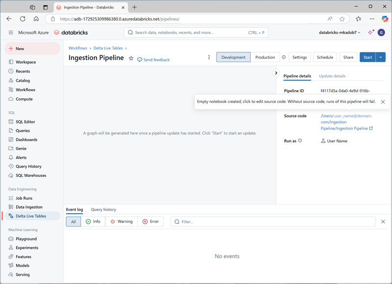

---
lab:
  title: End-to-End-Streamingpipeline mit Delta Live Tables in Azure Databricks
---

# End-to-End-Streamingpipeline mit Delta Live Tables in Azure Databricks

Das Erstellen einer End-to-End-Streamingpipeline mit Delta Live Tables in Azure Databricks umfasst die Definition von Transformationen für Daten, die Delta Live Tables dann durch Aufgaben-Orchestrierung, Clusterverwaltung und Überwachung verwaltet. Dieses Framework unterstützt Streamingtabellen für die Verarbeitung von Daten, die kontinuierlich aktualisiert werden, materialisierte Ansichten für komplexe Transformationen und Ansichten für Zwischentransformationen und Datenqualitätsprüfungen.

Dieses Lab dauert ungefähr **30** Minuten.

> **Hinweis**: Die Benutzeroberfläche von Azure Databricks wird kontinuierlich verbessert. Die Benutzeroberfläche kann sich seit der Erstellung der Anweisungen in dieser Übung geändert haben.

## Bereitstellen eines Azure Databricks-Arbeitsbereichs

> **Tipp**: Wenn Sie bereits über einen Azure Databricks-Arbeitsbereich verfügen, können Sie dieses Verfahren überspringen und Ihren vorhandenen Arbeitsbereich verwenden.

Diese Übung enthält ein Skript zum Bereitstellen eines neuen Azure Databricks-Arbeitsbereichs. Das Skript versucht, eine Azure Databricks-Arbeitsbereichsressource im *Premium*-Tarif in einer Region zu erstellen, in der Ihr Azure-Abonnement über ein ausreichendes Kontingent für die in dieser Übung erforderlichen Computekerne verfügt. Es wird davon ausgegangen, dass Ihr Benutzerkonto über ausreichende Berechtigungen im Abonnement verfügt, um eine Azure Databricks-Arbeitsbereichsressource zu erstellen. Wenn das Skript aufgrund unzureichender Kontingente oder Berechtigungen fehlschlägt, können Sie versuchen, [einen Azure Databricks-Arbeitsbereich interaktiv im Azure-Portal zu erstellen](https://learn.microsoft.com/azure/databricks/getting-started/#--create-an-azure-databricks-workspace).

1. Melden Sie sich in einem Webbrowser am [Azure-Portal](https://portal.azure.com) unter `https://portal.azure.com` an.
2. Verwenden Sie die Taste **[\>_]** rechts neben der Suchleiste oben auf der Seite, um eine neue Cloud Shell im Azure-Portal zu erstellen, und wählen Sie eine ***PowerShell***-Umgebung aus. Die Cloud Shell bietet eine Befehlszeilenschnittstelle in einem Bereich am unteren Rand des Azure-Portals, wie hier gezeigt:

    

    > **Hinweis**: Wenn Sie zuvor eine Cloud-Shell erstellt haben, die eine *Bash*-Umgebung verwendet, wechseln Sie zu ***PowerShell***.

3. Beachten Sie, dass Sie die Größe der Cloud-Shell ändern können, indem Sie die Trennlinie oben im Bereich ziehen oder die Symbole **&#8212;**, **&#10530;** und **X** oben rechts im Bereich verwenden, um den Bereich zu minimieren, zu maximieren und zu schließen. Weitere Informationen zur Verwendung von Azure Cloud Shell finden Sie in der [Azure Cloud Shell-Dokumentation](https://docs.microsoft.com/azure/cloud-shell/overview).

4. Geben Sie im PowerShell-Bereich die folgenden Befehle ein, um dieses Repository zu klonen:

     ```powershell
    rm -r mslearn-databricks -f
    git clone https://github.com/MicrosoftLearning/mslearn-databricks
     ```

5. Nachdem das Repository geklont wurde, geben Sie den folgenden Befehl ein, um das Skript **setup.ps1** auszuführen, das einen Azure Databricks-Arbeitsbereich in einer verfügbaren Region bereitstellt:

     ```powershell
    ./mslearn-databricks/setup.ps1
     ```

6. Wenn Sie dazu aufgefordert werden, wählen Sie aus, welches Abonnement Sie verwenden möchten (dies geschieht nur, wenn Sie Zugriff auf mehrere Azure-Abonnements haben).

7. Warten Sie, bis das Skript abgeschlossen ist. Dies dauert in der Regel etwa 5 Minuten, in einigen Fällen kann es jedoch länger dauern. Während Sie warten, lesen Sie den Artikel [Streaming und inkrementelle Erfassung](https://learn.microsoft.com/azure/databricks/ingestion/streaming) in der Azure Databricks-Dokumentation.

## Erstellen eines Clusters

Azure Databricks ist eine verteilte Verarbeitungsplattform, die Apache Spark-*Cluster* verwendet, um Daten parallel auf mehreren Knoten zu verarbeiten. Jeder Cluster besteht aus einem Treiberknoten, um die Arbeit zu koordinieren, und Arbeitsknoten zum Ausführen von Verarbeitungsaufgaben. In dieser Übung erstellen Sie einen *Einzelknotencluster* , um die in der Lab-Umgebung verwendeten Computeressourcen zu minimieren (in denen Ressourcen möglicherweise eingeschränkt werden). In einer Produktionsumgebung erstellen Sie in der Regel einen Cluster mit mehreren Workerknoten.

> **Tipp**: Wenn Sie bereits über einen Cluster mit einer Runtime 13.3 LTS oder einer höheren Runtimeversion in Ihrem Azure Databricks-Arbeitsbereich verfügen, können Sie ihn verwenden, um diese Übung abzuschließen und dieses Verfahren zu überspringen.

1. Navigieren Sie im Azure-Portal zur Ressourcengruppe **msl-*xxxxxxx***, die vom Skript erstellt wurde (oder zur Ressourcengruppe, die Ihren vorhandenen Azure Databricks-Arbeitsbereich enthält).

1. Wählen Sie die Ressource Ihres Azure Databricks-Diensts aus (sie trägt den Namen **databricks-*xxxxxxx***, wenn Sie das Setupskript zum Erstellen verwendet haben).

1. Verwenden Sie auf der Seite **Übersicht** für Ihren Arbeitsbereich die Schaltfläche **Arbeitsbereich starten**, um Ihren Azure Databricks-Arbeitsbereich auf einer neuen Browserregisterkarte zu öffnen. Melden Sie sich an, wenn Sie dazu aufgefordert werden.

    > **Tipp**: Während Sie das Databricks-Arbeitsbereichsportal verwenden, werden möglicherweise verschiedene Tipps und Benachrichtigungen angezeigt. Schließen Sie diese, und folgen Sie den Anweisungen, um die Aufgaben in dieser Übung auszuführen.

1. Wählen Sie in der linken Seitenleiste die Option **(+) Neue** Aufgabe und dann **Cluster** aus (ggf. im Untermenü **Mehr** suchen).

1. Erstellen Sie auf der Seite **Neuer Cluster** einen neuen Cluster mit den folgenden Einstellungen:
    - **Clustername**: Cluster des *Benutzernamens* (der Standardclustername)
    - **Richtlinie:** Unrestricted
    - **Clustermodus**: Einzelknoten
    - **Zugriffsmodus**: Einzelner Benutzer (*Ihr Benutzerkonto ist ausgewählt*)
    - **Databricks-Runtimeversion**: 13.3 LTS (Spark 3.4.1, Scala 2.12) oder höher
    - **Photonbeschleunigung verwenden**: Ausgewählt
    - **Knotentyp**: Standard_D4ds_v5
    - **Beenden nach** *20* **Minuten Inaktivität**

1. Warten Sie, bis der Cluster erstellt wurde. Es kann ein oder zwei Minuten dauern.

    > **Hinweis**: Wenn Ihr Cluster nicht gestartet werden kann, verfügt Ihr Abonnement möglicherweise über ein unzureichendes Kontingent in der Region, in der Ihr Azure Databricks-Arbeitsbereich bereitgestellt wird. Details finden Sie unter [Der Grenzwert für CPU-Kerne verhindert die Clustererstellung](https://docs.microsoft.com/azure/databricks/kb/clusters/azure-core-limit). In diesem Fall können Sie versuchen, Ihren Arbeitsbereich zu löschen und in einer anderen Region einen neuen zu erstellen. Sie können einen Bereich als Parameter für das Setupskript wie folgt angeben: `./mslearn-databricks/setup.ps1 eastus`

## Erstellen eines Notebook und Erfassen von Daten

1. Verwenden Sie in der Randleiste den Link ** (+) Neu**, um ein **Notebook** zu erstellen. Wählen Sie in der Dropdownliste **Verbinden** Ihren Cluster aus, wenn er noch nicht ausgewählt ist. Wenn der Cluster nicht ausgeführt wird, kann es eine Minute dauern, bis er gestartet wird.
2. Ändern Sie den Standardnamen des Notebooks (**Untitled Notebook *[Datum]***) in **Delta Live Tables Ingestion**.

3. Geben Sie in der ersten Zelle des Notebooks den folgenden Code ein, der mit *Shellbefehlen* die Datendateien von GitHub in das von Ihrem Cluster verwendete Dateisystem herunterlädt.

     ```python
    %sh
    rm -r /dbfs/device_stream
    mkdir /dbfs/device_stream
    !wget -O /dbfs/device_stream/device_data.csv https://github.com/MicrosoftLearning/mslearn-databricks/raw/main/data/device_data.csv
     ```

4. Verwenden Sie Menüoption **&#9656; Zelle Ausführen** links neben der Zelle, um sie auszuführen. Warten Sie dann, bis der vom Code ausgeführte Spark-Auftrag, abgeschlossen ist.

## Verwenden von Delta-Tabellen zum Streamen von Daten

Delta Lake unterstützt das *Streamen* von Daten. Deltatabellen können eine *Senke* oder *Quelle* für Datenströme sein, die mit der Spark Structured Streaming-API erstellt wurden. In diesem Beispiel verwenden Sie eine Deltatabelle als Senke für einige Streamingdaten in einem simulierten IoT-Szenario (Internet der Dinge). In der nächsten Aufgabe dient diese Delta-Tabelle als Quelle für die Datentransformation in Echtzeit.

1. Führen Sie den folgenden Code in einer neuen Zelle aus, um einen Datenstrom basierend auf dem Ordner, der die CSV-Gerätedaten enthält, zu erstellen:

     ```python
    from pyspark.sql.functions import *
    from pyspark.sql.types import *

    # Define the schema for the incoming data
    schema = StructType([
        StructField("device_id", StringType(), True),
        StructField("timestamp", TimestampType(), True),
        StructField("temperature", DoubleType(), True),
        StructField("humidity", DoubleType(), True)
    ])

    # Read streaming data from folder
    inputPath = '/device_stream/'
    iotstream = spark.readStream.schema(schema).option("header", "true").csv(inputPath)
    print("Source stream created...")

    # Write the data to a Delta table
    query = (iotstream
             .writeStream
             .format("delta")
             .option("checkpointLocation", "/tmp/checkpoints/iot_data")
             .start("/tmp/delta/iot_data"))
     ```

2. Verwenden Sie Menüoption **&#9656; Zelle Ausführen** links neben der Zelle, um sie auszuführen.

Diese Delta-Tabelle wird nun zur Quelle für die Datentransformation in Echtzeit.

   > Hinweis: Die obige Codezelle erstellt den Quelldatenstrom. Daher ändert sich die Auftragsausführung nie in einen abgeschlossenen Status. Um das Streaming manuell zu beenden, können Sie `query.stop()` in einer neuen Zelle ausführen.
   
## Erstellen einer Delta Live Tables-Pipeline.

Eine Pipeline ist die Haupteinheit, die zur Konfiguration und Ausführung von Datenverarbeitungs-Workflows mit Delta Live Tables verwendet wird. Sie verknüpft Datenquellen mit Zieldatensätzen über einen in Python oder SQL deklarierten gerichteten azyklischen Graph (Directed Acyclic Graph, DAG).

1. Wählen Sie **Delta Live Tables** in der linken Randleiste und dann **Pipeline erstellen** aus.

2. Erstellen Sie auf der Seite **Pipeline erstellen** eine neue Pipeline mit den folgenden Einstellungen:
    - **Pipeline Name**: `Ingestion Pipeline`
    - **Produktedition**: Erweitert
    - **Pipelinemodus**: Ausgelöst
    - **Quellcode**: *Leer lassen*
    - **Speicheroptionen**: Hive-Metastore
    - **Speicherort**: `dbfs:/pipelines/device_stream`
    - **Zielschema**: `default`

3. Wählen Sie **Erstellen** aus, um die Pipeline zu erstellen (dadurch wird auch ein leeres Notebook für den Pipeline-Code erstellt).

4. Nachdem die Pipeline erstellt wurde, öffnen Sie den Link zum leeren Notizbuch unter **Quellcode** im rechten Bereich: Dadurch wird das Notebook auf einer neuen Browserregisterkarte geöffnet:

    

5. Drücken Sie in der ersten Zelle des leeren Notebooks die Eingabetaste (aber führen Sie den folgenden Code nicht aus), um Delta-Live-Tabellen zu erstellen und die Daten zu transformieren:

     ```python
    import dlt
    from pyspark.sql.functions import col, current_timestamp
     
    @dlt.table(
        name="raw_iot_data",
        comment="Raw IoT device data"
    )
    def raw_iot_data():
        return spark.readStream.format("delta").load("/tmp/delta/iot_data")

    @dlt.table(
        name="transformed_iot_data",
        comment="Transformed IoT device data with derived metrics"
    )
    def transformed_iot_data():
        return (
            dlt.read("raw_iot_data")
            .withColumn("temperature_fahrenheit", col("temperature") * 9/5 + 32)
            .withColumn("humidity_percentage", col("humidity") * 100)
            .withColumn("event_time", current_timestamp())
        )
     ```

6. Schließen Sie die Browserregisterkarte, die das Notebook enthält (die Inhalte werden automatisch gespeichert), und kehren Sie zur Pipeline zurück. Wählen Sie dann **Starten** aus.

7. Nachdem die Pipeline erfolgreich abgeschlossen wurde, navigieren Sie zurück zur **Erfassung mit Delta Live-Tabellen**, die Sie zuerst erstellt haben, und überprüfen Sie, ob die neuen Tabellen am angegebenen Speicherort erstellt wurden, indem Sie den folgenden Code in einer neuen Zelle ausführen:

     ```sql
    %sql
    SHOW TABLES
     ```

## Anzeigen von Ergebnissen als Visualisierung

Nach dem Erstellen der Tabellen ist es möglich, sie in Datenframes zu laden und die Daten zu visualisieren.

1. Fügen Sie im ersten Notizbuch eine neue Codezelle hinzu, und führen Sie den folgenden Code aus, um den `transformed_iot_data` Code in einen Datenframe zu laden:

    ```python
    %sql
    SELECT * FROM transformed_iot_data
    ```

1. Wählen Sie oberhalb der Ergebnistabelle **+** und dann **Visualisierung** aus, um den Visualisierungs-Editor anzuzeigen, und wenden Sie dann die folgenden Optionen an:
    - **Visualisierungstyp**: Linie
    - **X-Spalte**: Zeitstempel
    - **Y-Spalte**: *Fügen Sie eine neue Spalte hinzu, und wählen Sie***temperature_fahrenheit** aus. *Wenden Sie die Aggregation* **Summe** *aus*.

1. Speichern Sie die Visualisierung, und zeigen Sie das resultierende Diagramm im Notebook an.
1. Fügen Sie eine neue Codezelle hinzu und geben Sie den folgenden Code ein, um die Streaming-Abfrage zu stoppen:

    ```python
    query.stop()
    ```
    

## Bereinigen

Wählen Sie zunächst im Azure Databricks-Portal auf der Seite **Compute** Ihren Cluster und dann **&#9632; Beenden** aus, um ihn herunterzufahren.

Wenn Sie die Erkundung von Azure Databricks abgeschlossen haben, löschen Sie die erstellten Ressourcen, um unnötige Azure-Kosten zu vermeiden und Kapazität in Ihrem Abonnement freizugeben.
