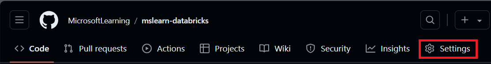
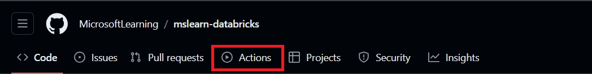

---
lab:
  title: Implementieren von CI/CD-Workflows mit Azure Databricks
---

# Implementieren von CI/CD-Workflows mit Azure Databricks

Die Implementierung von CI/CD-Workflows mit GitHub Actions und Azure Databricks kann Ihren Entwicklungsprozess optimieren und die Automatisierung verbessern. GitHub-Aktionen bieten eine leistungsstarke Plattform zum Automatisieren von Softwareworkflows, einschließlich Continuous Integration (CI) und Continuous Delivery (CD). Wenn diese Workflows in Azure Databricks integriert sind, können komplexe Datenaufgaben wie das Ausführen von Notebooks oder das Bereitstellen von Updates in Databricks-Umgebungen ausgeführt werden. Sie können beispielsweise GitHub-Aktionen verwenden, um die Bereitstellung von Databricks-Notebooks zu automatisieren, Databricks-Dateisystemuploads zu verwalten und die Databricks-CLI in Ihren Workflows einzurichten. Diese Integration sorgt dafür, dass der Entwicklungszyklus effizienter und fehlersicherer ist, insbesondere für datengesteuerte Anwendungen.

Dieses Lab dauert ungefähr **40** Minuten.

> **Hinweis**: Die Benutzeroberfläche von Azure Databricks wird kontinuierlich verbessert. Die Benutzeroberfläche kann sich seit der Erstellung der Anweisungen in dieser Übung geändert haben.

>**Hinweis:** Sie benötigen ein Github-Konto, um diese Übung abzuschließen.

## Bereitstellen eines Azure Databricks-Arbeitsbereichs

> **Tipp**: Wenn Sie bereits über einen Azure Databricks-Arbeitsbereich verfügen, können Sie dieses Verfahren überspringen und Ihren vorhandenen Arbeitsbereich verwenden.

Diese Übung enthält ein Skript zum Bereitstellen eines neuen Azure Databricks-Arbeitsbereichs. Das Skript versucht, eine Azure Databricks-Arbeitsbereichsressource im *Premium*-Tarif in einer Region zu erstellen, in der Ihr Azure-Abonnement über ein ausreichendes Kontingent für die in dieser Übung erforderlichen Computekerne verfügt. Es wird davon ausgegangen, dass Ihr Benutzerkonto über ausreichende Berechtigungen im Abonnement verfügt, um eine Azure Databricks-Arbeitsbereichsressource zu erstellen. Wenn das Skript aufgrund unzureichender Kontingente oder Berechtigungen fehlschlägt, können Sie versuchen, [einen Azure Databricks-Arbeitsbereich interaktiv im Azure-Portal zu erstellen](https://learn.microsoft.com/azure/databricks/getting-started/#--create-an-azure-databricks-workspace).

1. Melden Sie sich in einem Webbrowser am [Azure-Portal](https://portal.azure.com) unter `https://portal.azure.com` an.
2. Verwenden Sie die Taste **[\>_]** rechts neben der Suchleiste oben auf der Seite, um eine neue Cloud Shell im Azure-Portal zu erstellen, und wählen Sie eine ***PowerShell***-Umgebung aus. Die Cloud Shell bietet eine Befehlszeilenschnittstelle in einem Bereich am unteren Rand des Azure-Portals, wie hier gezeigt:

    

    > **Hinweis**: Wenn Sie zuvor eine Cloud-Shell erstellt haben, die eine *Bash*-Umgebung verwendet, wechseln Sie zu ***PowerShell***.

3. Beachten Sie, dass Sie die Größe der Cloud-Shell ändern können, indem Sie die Trennlinie oben im Bereich ziehen oder die Symbole **&#8212;**, **&#10530;** und **X** oben rechts im Bereich verwenden, um den Bereich zu minimieren, zu maximieren und zu schließen. Weitere Informationen zur Verwendung von Azure Cloud Shell finden Sie in der [Azure Cloud Shell-Dokumentation](https://docs.microsoft.com/azure/cloud-shell/overview).

4. Geben Sie im PowerShell-Bereich die folgenden Befehle ein, um dieses Repository zu klonen:

     ```powershell
    rm -r mslearn-databricks -f
    git clone https://github.com/MicrosoftLearning/mslearn-databricks
     ```

5. Nachdem das Repository geklont wurde, geben Sie den folgenden Befehl ein, um das Skript **setup.ps1** auszuführen, das einen Azure Databricks-Arbeitsbereich in einer verfügbaren Region bereitstellt:

     ```powershell
    ./mslearn-databricks/setup.ps1
     ```

6. Wenn Sie dazu aufgefordert werden, wählen Sie aus, welches Abonnement Sie verwenden möchten (dies geschieht nur, wenn Sie Zugriff auf mehrere Azure-Abonnements haben).

7. Warten Sie, bis das Skript abgeschlossen ist. Dies dauert in der Regel etwa 5 Minuten, in einigen Fällen kann es jedoch länger dauern. Während Sie warten, lesen Sie den Artikel [Einführung in Delta Lake](https://docs.microsoft.com/azure/databricks/delta/delta-intro) in der Azure Databricks-Dokumentation.

## Erstellen eines Clusters

Azure Databricks ist eine verteilte Verarbeitungsplattform, die Apache Spark-*Cluster* verwendet, um Daten parallel auf mehreren Knoten zu verarbeiten. Jeder Cluster besteht aus einem Treiberknoten, um die Arbeit zu koordinieren, und Arbeitsknoten zum Ausführen von Verarbeitungsaufgaben. In dieser Übung erstellen Sie einen *Einzelknotencluster* , um die in der Lab-Umgebung verwendeten Computeressourcen zu minimieren (in denen Ressourcen möglicherweise eingeschränkt werden). In einer Produktionsumgebung erstellen Sie in der Regel einen Cluster mit mehreren Workerknoten.

> **Tipp**: Wenn Sie bereits über einen Cluster mit einer Runtime 13.3 LTS oder einer höheren Runtimeversion in Ihrem Azure Databricks-Arbeitsbereich verfügen, können Sie ihn verwenden, um diese Übung abzuschließen und dieses Verfahren zu überspringen.

1. Navigieren Sie im Azure-Portal zur Ressourcengruppe **msl-*xxxxxxx***, die vom Skript erstellt wurde (oder zur Ressourcengruppe, die Ihren vorhandenen Azure Databricks-Arbeitsbereich enthält).

1. Wählen Sie die Ressource Ihres Azure Databricks-Diensts aus (sie trägt den Namen **databricks-*xxxxxxx***, wenn Sie das Setupskript zum Erstellen verwendet haben).

1. Verwenden Sie auf der Seite **Übersicht** für Ihren Arbeitsbereich die Schaltfläche **Arbeitsbereich starten**, um Ihren Azure Databricks-Arbeitsbereich auf einer neuen Browserregisterkarte zu öffnen. Melden Sie sich an, wenn Sie dazu aufgefordert werden.

    > **Tipp**: Während Sie das Databricks-Arbeitsbereichsportal verwenden, werden möglicherweise verschiedene Tipps und Benachrichtigungen angezeigt. Schließen Sie diese, und folgen Sie den Anweisungen, um die Aufgaben in dieser Übung auszuführen.

1. Wählen Sie zunächst in der Randleiste auf der linken Seite die Aufgabe **(+) Neu** und dann **Cluster** aus.

1. Erstellen Sie auf der Seite **Neuer Cluster** einen neuen Cluster mit den folgenden Einstellungen:
    - **Clustername**: Cluster des *Benutzernamens* (der Standardclustername)
    - **Richtlinie:** Unrestricted
    - **Clustermodus**: Einzelknoten
    - **Zugriffsmodus**: Einzelner Benutzer (*Ihr Benutzerkonto ist ausgewählt*)
    - **Databricks-Runtimeversion**: 13.3 LTS (Spark 3.4.1, Scala 2.12) oder höher
    - **Photonbeschleunigung verwenden**: Ausgewählt
    - **Knotentyp**: Standard_D4ds_v5
    - **Beenden nach** *20* **Minuten Inaktivität**

1. Warten Sie, bis der Cluster erstellt wurde. Es kann ein oder zwei Minuten dauern.

    > **Hinweis**: Wenn Ihr Cluster nicht gestartet werden kann, verfügt Ihr Abonnement möglicherweise über ein unzureichendes Kontingent in der Region, in der Ihr Azure Databricks-Arbeitsbereich bereitgestellt wird. Details finden Sie unter [Der Grenzwert für CPU-Kerne verhindert die Clustererstellung](https://docs.microsoft.com/azure/databricks/kb/clusters/azure-core-limit). In diesem Fall können Sie versuchen, Ihren Arbeitsbereich zu löschen und in einer anderen Region einen neuen zu erstellen. Sie können einen Bereich als Parameter für das Setupskript wie folgt angeben: `./mslearn-databricks/setup.ps1 eastus`

## Erstellen eines Notebook und Erfassen von Daten

1. Verwenden Sie in der Randleiste den Link ** (+) Neu**, um ein **Notebook** zu erstellen. Wählen Sie in der Dropdownliste **Verbinden** Ihren Cluster aus, wenn er noch nicht ausgewählt ist. Wenn der Cluster nicht ausgeführt wird, kann es eine Minute dauern, bis er gestartet wird.

2. Geben Sie in der ersten Zelle des Notebooks den folgenden Code ein, der mit *Shellbefehlen* die Datendateien von GitHub in das von Ihrem Cluster verwendete Dateisystem herunterlädt.

     ```python
    %sh
    rm -r /dbfs/FileStore
    mkdir /dbfs/FileStore
    wget -O /dbfs/FileStore/sample_sales.csv https://github.com/MicrosoftLearning/mslearn-databricks/raw/main/data/sample_sales.csv
     ```

3. Verwenden Sie Menüoption **&#9656; Zelle Ausführen** links neben der Zelle, um sie auszuführen. Warten Sie dann, bis der vom Code ausgeführte Spark-Auftrag, abgeschlossen ist.
   
## Einrichten eines GitHub-Repositorys

Nachdem Sie ein GitHub-Repository mit einem Azure Databricks-Arbeitsbereich verbunden haben, können Sie CI/CD-Pipelines einrichten, die bei jeder Änderung ausgelöst werden, die an Ihrem Repository vorgenommen wird.

1. Wechseln Sie zu Ihrem [GitHub-Konto](https://github.com/) , und erstellen Sie ein neues Repository für Ihr Projekt.

2. Klonen Sie das Repository mit `git clone` auf Ihren lokalen Computer.

3. Laden Sie die erforderlichen Dateien für diese Übung in Ihr lokales Repository herunter:
   - [CSV-Datei](https://github.com/MicrosoftLearning/mslearn-databricks/raw/main/data/sample_sales.csv)
   - [Databricks-Notebook](https://github.com/MicrosoftLearning/mslearn-databricks/raw/main/data/sample_sales_notebook.dbc)
   - [Auftragskonfigurationsdatei](https://github.com/MicrosoftLearning/mslearn-databricks/raw/main/data/job-config.json):

   Committen und pushen Sie die Änderungen.

## Einrichten von geheimen Repositoryschlüsseln

Geheimnisse sind Variablen, die du in einer Organisation, einem Repository oder einer Repositoryumgebung erstellst. Die von Ihnen erstellten Geheimnisse können in GitHub Actions-Workflows verwendet werden. GitHub Actions kann ein Geheimnis nur lesen, wenn Sie das Geheimnis explizit in einen Workflow einschließen.

Da GitHub Actions-Workflows auf Ressourcen von Azure Databricks zugreifen müssen, werden Anmeldeinformationen für die Verifizierung als verschlüsselte Variablen gespeichert, die mit den CI/CD-Pipelines verwendet werden sollen.

Bevor Sie Repositoryschlüssel erstellen, müssen Sie in Azure Databricks ein persönliches Zugriffstoken generieren:

1. Wählen Sie in Ihrem Azure Databricks-Arbeitsbereich in der oberen Leiste Ihren Azure Databricks-Benutzernamen und dann im Dropdownmenü die Option **Einstellungen** aus.

2. Wählen Sie **Entwickler** aus

3. Wählen Sie neben **Zugriffstoken** die Option **Verwalten** aus.

4. Wählen Sie **Neues Token generieren** und dann **Generieren** aus.

5. Kopieren Sie das angezeigte Token an einen sicheren Speicherort und wählen Sie **Fertig** aus.

6. Wählen Sie jetzt auf Ihrer Repository-Seite die Registerkarte **Einstellungen** aus.

   

7. Wählen Sie in der linken Randleiste **Geheime Schlüssel und Variablen** und dann ** Aktionen** aus.

8. Wählen Sie **Neuer Repositoryschlüssel** aus und fügen Sie jede dieser Variablen hinzu:
   - **Name:** DATABRICKS_HOST **Geheimer Schlüssel:** Fügen Sie die URL Ihres Databricks-Arbeitsbereichs hinzu.
   - **Name:** DATABRICKS_TOKEN **Geheimer Schlüssel:** Fügen Sie das zuvor generierte Zugriffstoken hinzu.

## Einrichten von CI-/CD-Pipelines

Nachdem Sie nun die erforderlichen Variablen für den Zugriff auf Ihren Azure Databricks-Arbeitsbereich von GitHub gespeichert haben, erstellen Sie Workflows zum Automatisieren der Datenaufnahme und -verarbeitung, die jedes Mal ausgelöst wird, wenn das Repository aktualisiert wird.

1. Wählen auf Ihrer Repository-Seite die Registerkarte **Aktionen** aus.

    

2. Wählen Sie **Workflow selbst einrichten** aus und geben Sie den folgenden Code ein:

     ```yaml
    name: CI Pipeline for Azure Databricks

    on:
      push:
        branches:
          - main
      pull_request:
        branches:
          - main

    jobs:
      deploy:
        runs-on: ubuntu-latest

        steps:
        - name: Checkout code
          uses: actions/checkout@v3

        - name: Set up Python
          uses: actions/setup-python@v4
          with:
            python-version: '3.x'

        - name: Install Databricks CLI
          run: |
            pip install databricks-cli

        - name: Configure Databricks CLI
          run: |
            databricks configure --token <<EOF
            ${{ secrets.DATABRICKS_HOST }}
            ${{ secrets.DATABRICKS_TOKEN }}
            EOF

        - name: Download Sample Data from DBFS
          run: databricks fs cp dbfs:/FileStore/sample_sales.csv . --overwrite
     ```

Dieser Code installiert und konfiguriert die Databricks-Befehlszeilenschnittstelle und lädt die Beispieldaten jedes Mal in Ihr Repository herunter, wenn ein Commit gepusht wird oder ein Pull Request zusammengeführt wird.

3. Benennen Sie den Workflow **CI-Pipeline** und wählen Sie **Änderungen committen** aus. Die Pipeline wird automatisch ausgeführt, und Sie können den Status auf der Registerkarte **Aktionen** überprüfen.

Sobald der Workflow abgeschlossen ist, ist es an der Zeit, die Konfigurationen für Ihre CD-Pipeline einzurichten.

4. Wechseln Sie zu Ihrer Arbeitsbereichsseite, wählen Sie **Compute** und dann Ihren Cluster aus.

5. Wählen Sie auf der Seite des Clusters **Mehr …** aus und wählen Sie dann **JSON anzeigen** aus. Kopieren Sie die ID des Clusters.

6. Öffnen Sie `job-config.json` in Ihrem Repository und ersetzen Sie `your_cluster_id` durch die soeben kopierte Cluster-ID. Ersetzen Sie außerdem `/Workspace/Users/your_username/your_notebook` durch den Pfad in Ihrem Arbeitsbereich, in dem Sie das Notebook speichern möchten, das in der Pipeline verwendet wird. Führen Sie für die Änderungen einen Commit aus.

> **Hinweis:** Wenn Sie zur Registerkarte **Aktionen** wechseln, sehen Sie, dass die CI-Pipeline erneut ausgeführt wurde. Da sie ausgelöst werden soll, wenn ein Commit gepusht wird, wird die Pipeline wie erwartet bereitgestellt, wenn `job-config.json` geändert wird.

7. Erstellen Sie auf der Registerkarte **Aktionen** einen neuen Workflow mit dem Namen **CD-Pipeline** und geben Sie den folgenden Code ein:

     ```yaml
    name: CD Pipeline for Azure Databricks

    on:
      push:
        branches:
          - main

    jobs:
      deploy:
        runs-on: ubuntu-latest

        steps:
        - name: Checkout code
          uses: actions/checkout@v3

        - name: Set up Python
          uses: actions/setup-python@v4
          with:
            python-version: '3.x'

        - name: Install Databricks CLI
          run: pip install databricks-cli

        - name: Configure Databricks CLI
          run: |
            databricks configure --token <<EOF
            ${{ secrets.DATABRICKS_HOST }}
            ${{ secrets.DATABRICKS_TOKEN }}
            EOF
        - name: Upload Notebook to DBFS
          run: databricks fs cp /path/to/your/notebook /Workspace/Users/your_username/your_notebook --overwrite
          env:
            DATABRICKS_TOKEN: ${{ secrets.DATABRICKS_TOKEN }}

        - name: Run Databricks Job
          run: |
            databricks jobs create --json-file job-config.json
            databricks jobs run-now --job-id $(databricks jobs list | grep 'CD pipeline' | awk '{print $1}')
          env:
            DATABRICKS_TOKEN: ${{ secrets.DATABRICKS_TOKEN }}
     ```

Ersetzen Sie vor dem Committen der Änderungen `/path/to/your/notebook` durch den Pfad zum Verzeichnis Ihres Notebooks in Ihrem Repository und `/Workspace/Users/your_username/your_notebook` durch den Dateipfad, in dem das Notebook in Ihrem Azure Databricks-Arbeitsbereich gespeichert werden soll.

Dieser Code installiert und konfiguriert die Databricks-Befehlszeilenschnittstelle erneut, importiert das Notebook in Ihr Databricks-Dateisystem und erstellt und führt einen Auftrag aus, den Sie auf der Seite **Workflows** Ihres Arbeitsbereichs überwachen können. Überprüfen Sie die Ausgabe und verifizieren Sie, dass das Datenbeispiel geändert wurde.

## Bereinigen

Wählen Sie zunächst im Azure Databricks-Portal auf der Seite **Compute** Ihren Cluster und dann **&#9632; Beenden** aus, um ihn herunterzufahren.

Wenn Sie die Erkundung von Azure Databricks abgeschlossen haben, löschen Sie die erstellten Ressourcen, um unnötige Azure-Kosten zu vermeiden und Kapazität in Ihrem Abonnement freizugeben.
