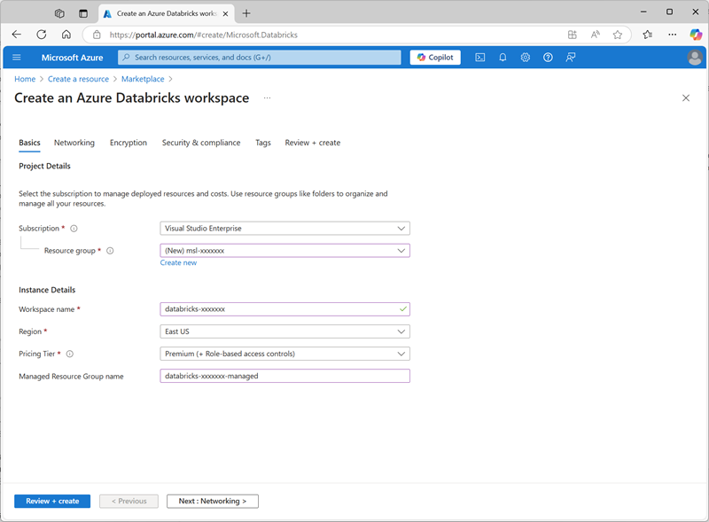
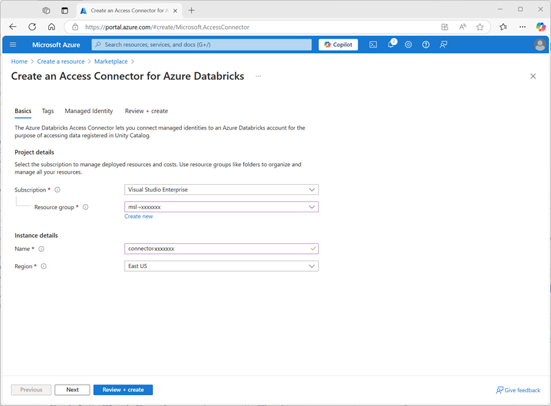
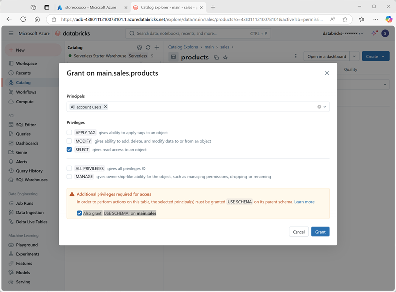

---
lab:
  title: Erkunden Sie Unity Catalog in Azure Databricks
---

# Erkunden Sie Unity Catalog in Azure Databricks

Unity Catalog bietet eine zentralisierte Governance-Lösung für Daten und KI und vereinfacht die Sicherheit durch die Bereitstellung einer zentralen Stelle für die Verwaltung und Prüfung des Datenzugriffs. In dieser Übung konfigurieren Sie Unity Catalog für einen Azure Databricks-Arbeitsbereich und verwenden ihn zum Verwalten von Daten.

> **Hinweis**: In einigen Fällen ist Unity Catalog möglicherweise bereits für Ihren Arbeitsbereich aktiviert. Sie können die Schritte in dieser Übung trotzdem ausführen, um Ihrem Katalog ein neues Speicherkonto zuzuweisen.

Dieses Lab dauert ungefähr **45** Minuten.

> **Hinweis**: Die Benutzeroberfläche von Azure Databricks wird kontinuierlich verbessert. Die Benutzeroberfläche kann sich seit der Erstellung der Anweisungen in dieser Übung geändert haben.

## Vor der Installation

Sie benötigen ein [Azure-Abonnement](https://azure.microsoft.com/free), in dem Sie <u>globale Administratorrechte</u> besitzen.

> **WICHTIG**: Bei dieser Übung wird davon ausgegangen, dass Sie über *globale Administratorrechte* in Ihrem Azure-Abonnement verfügen. Diese Zugriffsebene ist erforderlich, um das Databricks-Konto zu verwalten und Unity Catalog in einem Azure Databricks-Arbeitsbereich zu aktivieren.

## Erstellen eines Azure Databricks-Arbeitsbereichs

> **Tipp**: Wenn Sie bereits über einen Premium-Arbeitsbereich für Azure Databricks verfügen, können Sie dieses Verfahren überspringen und Ihren vorhandenen Arbeitsbereich verwenden.

1. Melden Sie sich beim **Azure-Portal** unter `https://portal.azure.com` an.
2. Erstellen Sie eine **Azure Databricks**-Ressource mit den folgenden Einstellungen:
    - **Abonnement:** *Wählen Sie Ihr Azure-Abonnement aus.*
    - **Ressourcengruppe**: *Erstellen einer neuen Ressourcengruppe mit dem Namen `msl-xxxxxxx` (wobei „xxxxxxx“ ein eindeutiger Wert ist)*
    - **Arbeitsbereichsname**: `databricks-xxxxxxx`*(wobei „xxxxxxx“ der Wert ist, der im Ressourcengruppennamen verwendet wird)*
    - **Region**: *Wählen Sie eine beliebige verfügbare Region aus.*
    - **Preisstufe**: *Premium* oder *Testversion*
    - **Gruppenname der verwalteten Ressource**: `databricks-xxxxxxx-managed`*(wobei „xxxxxxx“ der Wert ist, der im Ressourcengruppennamen verwendet wird)*

    

3. Wählen Sie **Überprüfen + Erstellen** und warten Sie, bis die Bereitstellung abgeschlossen ist.

## Vorbereiten des Speichers für den Katalog

Bei Verwendung von Unity Catalog in Azure Databricks werden Daten in einem externen Speicher gespeichert, der für mehrere Arbeitsbereiche freigegeben werden kann. In Azure ist es üblich, zu diesem Zweck ein Azure Storage-Konto mit Unterstützung für einen hierarchischen Azure Data Lake Storage Gen2-Namespace zu verwenden.

1. Erstellen Sie im Azure-Portal eine neue **Speicherkonto**-Ressource mit den folgenden Einstellungen:
    - **Grundlagen**:
        - **Abonnement:** *Wählen Sie Ihr Azure-Abonnement aus.*
        - **Ressourcengruppe**: *Wählen Sie die vorhandene **msl-xxxxxxx**-Ressourcengruppe aus, in der Sie den Azure Databricks-Arbeitsbereich erstellt haben.*
        - **Name des Speicherkontos**: `storexxxxxxx`*(wobei „xxxxxxx“ der Wert ist, der im Ressourcengruppennamen verwendet wird)*
        - **Region**: *Wählen Sie die <u>Region aus, in der Sie den Azure Databricks-Arbeitsbereich erstellt haben</u>*
        - **Primärer Dienst**: Azure Blob Storage oder Azure Data Lake Storage Gen 2
        - **Leistung**: Standard
        - **Redundanz**: Lokal redundanter Speicher (LRS) *(Für eine Nichtproduktionslösung wie diese Übung hat diese Option niedrigere Kosten und Vorteile beim Kapazitätsverbrauch)*
    - **Erweitert:**
        - **Hierarchischen Namenspace aktivieren**: *Ausgewählt*
    
    

1. Wählen Sie **Überprüfen + Erstellen** und warten Sie, bis die Bereitstellung abgeschlossen ist.
1. Wenn die Bereitstellung abgeschlossen ist, wechseln Sie zur bereitgestellten Speicherkontoressource *storexxxxxxx* und verwenden Sie deren Seite **Speicherbrowser**, um einen neuen BLOB-Container mit dem Namen `data` hinzuzufügen. Hier werden die Daten für Ihre Unity Catalog-Objekte gespeichert.

    

## Konfigurieren des Zugriffs auf den Katalogspeicher

Um auf den BLOB-Container zuzugreifen, den Sie für Unity Catalog erstellt haben, muss Ihr Azure Databricks-Arbeitsbereich ein verwaltetes Konto verwenden, um über einen *Zugriffsconnector* eine Verbindung mit dem Speicherkonto herzustellen.

1. Erstellen Sie im Azure-Portal einen neuen **Access-Connector für die Azure Databricks**-Ressource mit den folgenden Einstellungen:
    - **Abonnement:** *Wählen Sie Ihr Azure-Abonnement aus.*
    - **Ressourcengruppe**: *Wählen Sie die vorhandene **msl-xxxxxxx**-Ressourcengruppe aus, in der Sie den Azure Databricks-Arbeitsbereich erstellt haben.*
    - **Name**: `connector-xxxxxxx`*(wobei „xxxxxxx“ der Wert ist, der im Ressourcengruppennamen verwendet wird)*
    - **Region**: *Wählen Sie die <u>Region aus, in der Sie den Azure Databricks-Arbeitsbereich erstellt haben</u>*

    

1. Wählen Sie **Überprüfen + Erstellen** und warten Sie, bis die Bereitstellung abgeschlossen ist. Gehen Sie dann zur bereitgestellten Ressource und finden Sie auf der **Überblickseite** den Hinweis **Ressourcen-ID**, die im Format */subscriptions/abc-123.../resourceGroups/msl-xxxxxxx/providers/Microsoft.Databricks/accessConnectors/connector-xxxxxxx* vorliegen sollte – diese benötigen Sie später.
1. Kehren Sie im Azure-Portal zur Speicherkonto-Ressource *storexxxxxxx* zurück und fügen Sie auf deren Seite **Zugriffssteuerung (IAM)** eine neue Rollenzuweisung hinzu.
1. Suchen Sie in der Liste der **Stellenfunktionsrollen** nach der Rolle `Storage blob data contributor` und wählen Sie sie aus.

    

1. Wählen Sie **Weiter** aus. Wählen Sie dann auf der Seite **Mitglieder** die Option zum Zuweisen des Zugriffs auf eine **verwaltete Identität** aus und suchen Sie dann den zuvor erstellten Zugriffsconnector `connector-xxxxxxx` für Azure Databricks (alle anderen Zugriffsconnectors, die in Ihrem Abonnement erstellt wurden, können Sie ignorieren).

    

1. Überprüfen Sie die Rolle „Mitgliedschaft“ und weisen Sie sie zu, um die verwaltete Identität für Ihren Zugriffsconnector *connector-xxxxxxx* für Azure Databricks zur Rolle „Storage blob data contributor“ für Ihr Speicherkonto *storexxxxxxx* hinzuzufügen, damit dieses auf Daten im Speicherkonto zugreifen kann.

## Konfigurieren des Unity-Katalogs

Nachdem Sie nun einen Blob Storage-Container für Ihren Katalog erstellt und eine Möglichkeit für eine von Azure Databricks verwaltete Identität bereitgestellt haben, um darauf zuzugreifen, können Sie Unity Catalog so konfigurieren, dass ein Metastore basierend auf Ihrem Speicherkonto verwendet wird.

1. Rufen Sie im Azure-Portal die Ressourcengruppe **msl-*xxxxxxx*** auf, die nun drei Ressourcen enthalten sollte:
    - Der **databricks-*xxxxxxx*** Azure Databricks-Arbeitsbereich
    - Das **Geschäft*xxxxxxx*** Lagerkonto
    - Der **connector-*xxxxxxx*** Zugriffs-Connector für Azure Databricks

1. Öffnen Sie die **databricks-xxxxxxx** Azure Databricks-Arbeitsbereichsressource, die Sie früher erstellt haben, und verwenden Sie auf der **Überblickseite** die Schaltfläche **Arbeitsbereich starten**, um Ihren Azure Databricks-Arbeitsbereich in einer neuen Browser-Registerkarte zu öffnen. Melden Sie sich an, wenn Sie dazu aufgefordert werden.
1. Wählen Sie im Menü **databricks-*xxxxxxx*** oben rechts die Option **Konto verwalten** aus, um die Azure Databricks-Kontokonsole in einem anderen Tab zu öffnen.

    

    > **Hinweis**: Wenn ***Konto verwalten*** nicht aufgeführt ist oder sich nicht erfolgreich öffnen lässt, müssen Sie Ihr Konto möglicherweise von einem globalen Administrator zur Rolle ***Kontoadministrator*** in Ihrem Azure Databricks-Arbeitsbereich hinzufügen lassen.
    >
    > Wenn Sie ein persönliches Azure-Abonnement verwenden, das Sie mit einem persönlichen Microsoft-Konto (z. B. einem oultook.com-Konto) erstellt haben, wurde möglicherweise automatisch ein „externes“ Entra-ID-Konto in Ihrem Azure-Verzeichnis erstellt, und Sie müssen sich möglicherweise mit diesem Kontonamen anmelden.
    >
    > Hilfe finden Sie in ***[diesem Frage-und-Antwort-Thread](https://learn.microsoft.com/answers/questions/2133569/not-able-to-access-databricks-manage-account-conso)***.

1. Wählen Sie in der Azure Databricks-Kontokonsole auf der Seite **Katalog** die Option **Metastore erstellen** aus.
1. Erstellen Sie einen neuen Metastore mit den folgenden Einstellungen:
    - **Name**: `metastore-xxxxxxx`*(wobei xxxxxxx der eindeutige Wert ist, den Sie in dieser Übung für Ressourcen verwendet haben)*
    - **Region**: *Wählen Sie die Region aus, in der Sie Ihre Azure-Ressourcen erstellt haben*
    - **ADLS Gen 2 Pfad**: `data@storexxxxxxx.dfs.core.windows.net/`*(wobei storexxxxxx der Name Ihres Speicherkontos ist)*
    - **Access Connector-ID**: *Die Ressourcen-ID für Ihren Access Connector (von der Überblickseite im Azure-Portal kopiert)*

    

1. Wählen Sie nach dem Erstellen des Metastores den Arbeitsbereich **databricks-*xxxxxxx*** aus und weisen Sie ihm den Metastore zu.

    

## Arbeiten mit Daten im Unity-Katalog

Nachdem Sie einen „Eternal Metastore“ zugewiesen und Unity Catalog aktiviert haben, können Sie damit mit Daten in Azure Databricks arbeiten.

### Erstellen und Laden einer Tabelle

1. Schließen Sie die Registerkarte „Browser“ der Azure Databricks-Kontokonsole und kehren Sie zur Registerkarte für Ihren Azure Databricks-Arbeitsbereich zurück. Aktualisieren Sie dann <u>den Browser</u>.
1. Wählen Sie auf der Seite **Katalog** den **Hauptkatalog** für Ihre Organisation aus. Hinweis: Die Schemas **default** und **Information_schema** wurden bereits in Ihrem Katalog erstellt.

    

1. Wählen Sie **Create Schema** aus und erstellen Sie ein neues Schema mit dem Namen `sales` (lassen Sie den Speicherort unangegeben, damit der Standard-Metastore für den Katalog verwendet wird).
1. Laden Sie die Datei [**products.csv**](https://raw.githubusercontent.com/MicrosoftLearning/mslearn-databricks/main/data/products.csv) von `https://raw.githubusercontent.com/MicrosoftLearning/mslearn-databricks/main/data/products.csv` auf Ihren lokalen Computer herunter und speichern Sie sie als **products.csv**.
1. Wählen Sie im Katalog-Explorer im Azure Databricks-Arbeitsbereich bei ausgewähltem **sales**-Schema **Create** > **Create table** aus. Laden Sie dann die **products.csv**-Datei hoch, die Sie heruntergeladen haben, um eine neue Tabelle mit dem Namen **products** im **sales**-Schema zu erstellen.

    > **Hinweis**: Es kann einige Minuten dauern, bis die serverlose Berechnung gestartet wird.

    

1. Erstellen Sie die -Tabelle. Wenn eine KI-generierte Beschreibung vorgeschlagen wird, akzeptieren Sie diese.

### Verwalten von Berechtigungen

1. Vergewissern Sie sich bei ausgewählter Tabelle **Produkte** auf der Registerkarte **Berechtigungen**, dass der neuen Tabelle standardmäßig keine Berechtigungen zugewiesen sind (Sie können darauf zugreifen, weil Sie über vollständige Administratorrechte verfügen, aber keine anderen Benutzende können die Tabelle abfragen).
1. Wählen Sie **Grant** aus und konfigurieren Sie den Zugriff auf die Tabelle wie folgt:
    - **Auftraggeber**: Alle Kontonutzende
    - **Privilegien**: AUSWÄHLEN
    - **Für den Zugriff sind zusätzliche Berechtigungen erforderlich**: Erteilen Sie auch die Berechtigung „USE SCHEMA“ für „main.sales“

    

### Verfolgen der Herkunft

1. Wählen Sie im Menü **+ Neu** die Option **Abfrage** aus und erstellen Sie eine neue Abfrage mit dem folgenden SQL-Code:

    ```sql
    SELECT Category, COUNT(*) AS Number_of_Products
    FROM main.sales.products
    GROUP BY Category; 
    ```

1. Stellen Sie sicher, dass die serverlose Datenverarbeitung verbunden ist, und führen Sie die Abfrage aus, um die Ergebnisse anzuzeigen.

    

1. Speichern Sie die Abfrage als `Products by Category` im Arbeitsbereichsordner für Ihr Azure Databricks-Benutzerkonto.
1. Kehren Sie zur Seite **Katalog** zurück. Erweitern Sie dann den **Haupt-** Katalog und das **Verkaufs-** Schema und wählen Sie die **Produkte**-Tabelle aus.
1. Wählen Sie auf der Registerkarte **Vererbung** die Option **Abfragen** aus, um zu überprüfen, ob die Vererbung von der von Ihnen erstellten Abfrage zur Quelltabelle von Unity Catalog nachverfolgt wurde.

    

## Bereinigen

In dieser Übung haben Sie Unity Catalog für einen Azure Databricks-Arbeitsbereich aktiviert und konfiguriert und ihn für die Arbeit mit Daten in einem Metastore verwendet. Weitere Informationen zu den Möglichkeiten von Unity Catalog in Azure Databricks finden Sie unter [Data Governance mit Unity Catalog](https://learn.microsoft.com/azure/databricks/data-governance/).

Wenn Sie die Erkundung von Azure Databricks abgeschlossen haben, löschen Sie die erstellten Ressourcen, um unnötige Azure-Kosten zu vermeiden und Kapazität in Ihrem Abonnement freizugeben.
